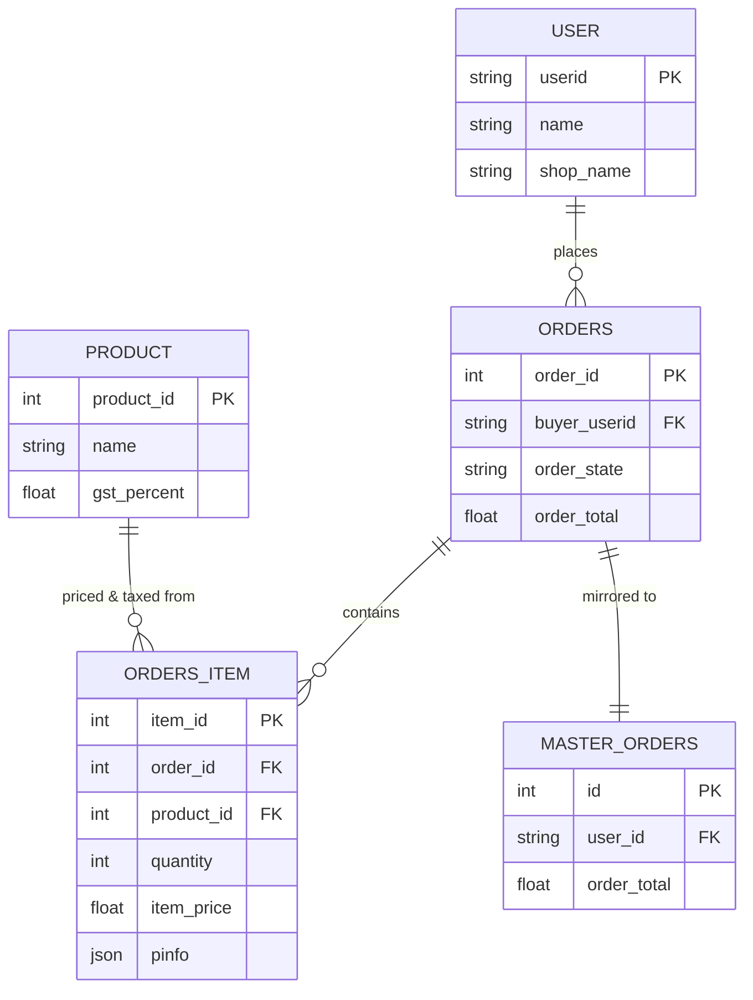

# Sales Order — How It Works

A simple explanation of what a Sales Order is, which tables it touches, how those tables connect to each other, and how tax gets calculated.

---

## 1. What is a Sales Order?

A Sales Order is just one record that says: **"this customer ordered these products, in these quantities, at these prices."**

It starts as a **draft** (`pending`). Nothing about stock, invoicing, or payment happens yet — it's simply a saved record of what was ordered.

If the account placing the order isn't a real, registered customer yet (just a lead), no order is created at all — there's no valid customer to save it against.

---

## 2. The tables behind it, and how they connect

A Sales Order isn't stored in one table — it's spread across a few, linked together by simple ID references:

| Table | What it holds | Connects to |
|---|---|---|
| **user** | The customer — name, shop, address, contact | — |
| **orders** | The order itself — one row per order: which customer, totals, dates, status | `buyer_userid` → `user.userid` |
| **orders_item** | The products in that order — one row per product line | `order_id` → `orders.order_id`, `product_id` → `product.product_id` |
| **product** | The catalog — product names, and each product's own **tax rate** | — |
| **master_orders** | A mirror copy of the order, kept for reporting | same id as `orders.order_id` |

**Read it like this:** one **user** can have many **orders**. One **order** can have many **orders_item** rows — one per product. Each **orders_item** row points at exactly one **product**, and that's where its tax rate comes from. Every order also gets one matching row in **master_orders**, kept in sync purely for reporting.

---

## 3. How an order actually gets built

This is what happens to the data, step by step:

1. **A product is chosen.** Its tax rate (`gst_percent`) comes along with it from the `product` table.
2. **Quantity and price are entered.** The price is tax-inclusive — the final amount the customer pays per unit.
3. **On save, two things get written together:**
   - One row in `orders` — the header: which customer, what date, what totals.
   - One row in `orders_item` **per product** — quantity, price, and a small JSON block (`pinfo`) holding the unit and the tax split.
4. **A mirror row is written to `master_orders`** at the same time, so reporting always has a matching copy.
5. **The tax split is never taken from what was typed or previewed.** Whatever tax number was shown is thrown away — the real value is looked up fresh from `product.gst_percent` and split evenly into SGST + CGST. This happens the exact same way whether the order is being created for the first time, or its items are being edited later.

---

## 4. The one rule worth remembering

> **What's typed is a preview. What's stored is recalculated.**
>
> Quantity and price are exactly what was entered. But tax is never trusted as typed — it's always looked up fresh from the product's own record, every single time an order is saved. That's what keeps the numbers honest even if an order is edited weeks later.

---

*A Sales Order = one `orders` row + one `orders_item` row per product, linked by `order_id` — with tax always sourced from `product`, never from what was entered.*
