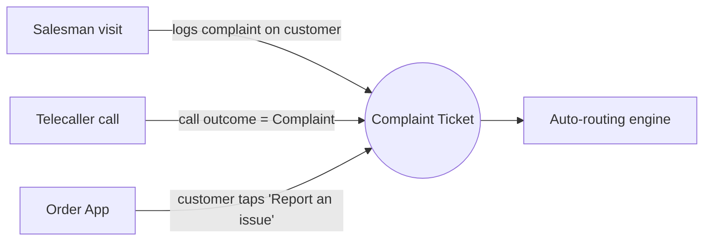
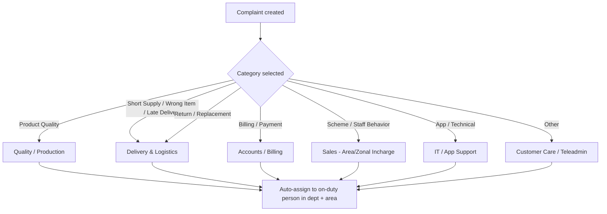
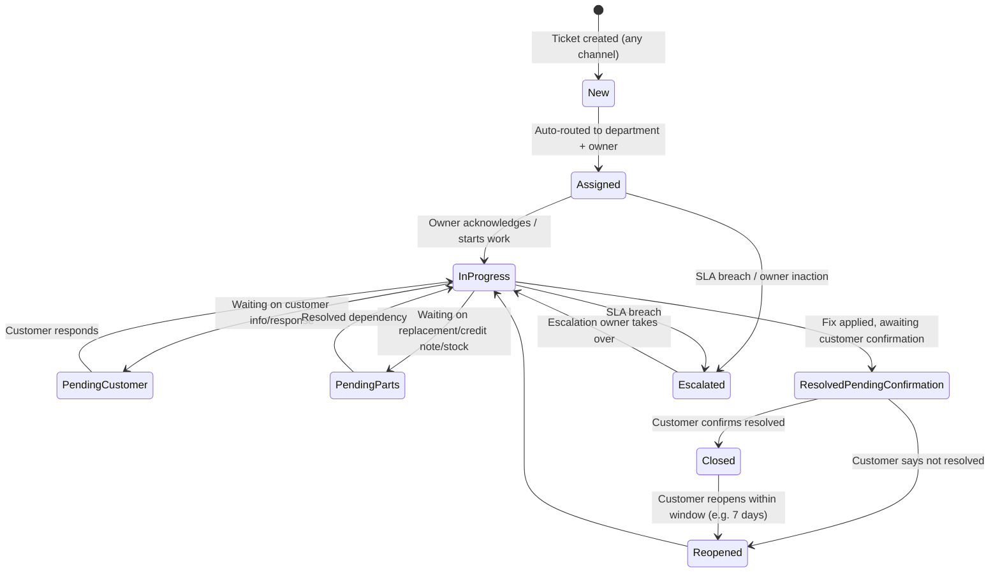
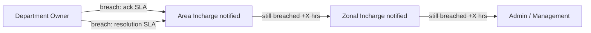
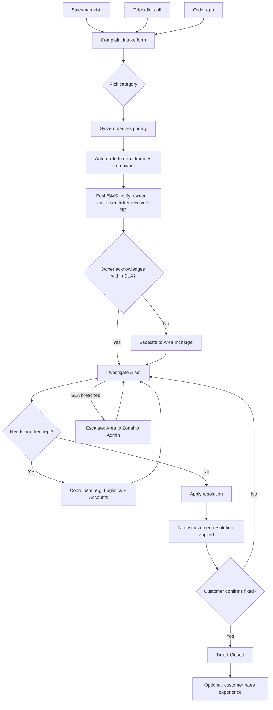

# Complaint Management — End-to-End Process Design

**Prepared for:** Loagma CRM · 25 July 2026
**Status:** Research / proposal — no complaint module exists in the CRM today. This document designs one from scratch, grounded in the modules that already exist (Telecaller, Salesman/Delivery staff, Order Funnel, Incharge hierarchy, Call Logs).

---

## 1. Why this document exists

Today a customer complaint can enter the business through three different doors — a **salesman's field visit**, a **telecaller's call**, or the **order app** — but there is no single system that:

- captures the complaint in one consistent format regardless of which door it came through,
- automatically decides **which department** should handle it,
- tracks it as a **ticket** until it is actually resolved (not just logged and forgotten),
- gives management visibility into **how long** things are taking and **where** they are stuck.

Right now the only trace of "complaint" in the CRM is a free-text option inside the salesman's notes screen (`order_funnel_screen.dart` → *Notes Related To → Complaint*) — it gets written down, but nothing routes it, tracks it, or closes the loop. This document defines the full process so it can be built as a proper module.

---

## 2. Design principles

1. **One complaint = one ticket, one ID**, no matter which of the 3 channels created it.
2. **Every ticket has an owner** — a specific department, and inside it a specific person — at every point in time. A ticket is never "everyone's problem."
3. **Routing is automatic**, driven by *what* the complaint is about (category), not *who* logged it.
4. **Nothing closes itself** — a ticket only reaches Closed after the customer (or the person who raised it on the customer's behalf) confirms the issue is actually fixed.
5. **Every action is timestamped** — who did what, when — so SLA breaches and repeat complaints are visible, not anecdotal.
6. **Reuse what the CRM already has**: employee identity, roles, area/beat mapping, call logs, order data — a complaint should never ask the user to re-enter information the CRM already knows (customer name, area, past orders, assigned salesman/telecaller).

---

## 3. The three intake channels

| # | Channel | Who logs it | What's already there to reuse |
|---|---|---|---|
| 1 | **Salesman field visit** | Salesman/Delivery staff (`deli_staff`), on the spot during a beat-plan visit | `BeatPlanController`, `beat_plan_visit_crm`, customer/account already open on screen |
| 2 | **Telecaller call** | Telecaller, during an outbound/inbound call | `CallLogController` / `call_log_crm` (already has `account_id`, `account_type`, `notes`, `call_outcome`) — a complaint is naturally a new `call_outcome` value |
| 3 | **Order app** (customer self-service) | Customer directly, against a specific order | `OrderFunnelController` / order history — complaint should link straight to an `order_id` |

All three feed into the **same complaint ticket table** — the channel is stored as metadata (`source_channel`), never a separate workflow.

### 3.1 Salesman visit
- Salesman is on a beat-plan visit, opens the customer/account screen, taps **Raise Complaint** instead of (or alongside) a regular note.
- Captures: customer/account (auto-filled from the visit), complaint category, description, photo (e.g. damaged product, short supply), optional order reference if the visit is delivery-related.
- Ticket is created with `source_channel = salesman_visit`, `raised_by = <salesman mobile>`, `account_id` from the beat plan.

### 3.2 Telecaller call
- Telecaller is logging a call outcome (existing `answered/busy/no_answer/switch_off/invalid/callback`). **Complaint** becomes a new outcome/branch: when selected, a complaint sub-form opens (category, description, related order if any) instead of just a free-text note.
- Ticket is created with `source_channel = telecaller_call`, `raised_by = <telecaller mobile>`, linked to the same `account_id`/`call_log_id` so the call recording and the ticket are cross-referenced.

### 3.3 Order app (customer self-service)
- Customer opens an order in their order history and taps **Report a problem** (or a general "Raise a complaint" entry point not tied to a specific order — e.g. a billing dispute).
- Captures: order reference (if applicable), category, description, photo/video upload.
- Ticket is created with `source_channel = order_app`, `raised_by = customer`, and — because there is no employee present to triage it — it is **auto-classified** by category (see §4) with no manual step before routing.

---

## 4. Complaint categories → department routing matrix

This is the core of the design: **the category the complaint is filed under decides which department owns it.** Category is chosen at intake (a fixed dropdown, not free text) so routing can be automatic and reporting can be trusted.

| Category | Example | Owning department | Typical resolver |
|---|---|---|---|
| **Product Quality / Damaged Goods** | Spoiled, expired, damaged, contaminated product | Quality / Production | QA team, escalates to plant/production if a batch issue |
| **Short Supply / Quantity Mismatch** | Ordered 10, delivered 8 | Delivery & Logistics | Dispatch/warehouse team, delivery staff supervisor |
| **Wrong Item Delivered** | Wrong SKU/product delivered | Delivery & Logistics | Dispatch team |
| **Late / Missed Delivery** | Delivery didn't arrive on schedule | Delivery & Logistics | Route/beat supervisor (Area Incharge) |
| **Billing / Payment Discrepancy** | Overcharged, wrong invoice, payment not reflected | Accounts / Billing | Accounts team |
| **Scheme / Discount Not Applied** | Promised scheme/discount missing on bill | Sales | Area/Zonal Incharge |
| **Salesman / Delivery Staff Behavior** | Rude behavior, unprofessional conduct | Sales / HR | Area Incharge → HR if serious |
| **Order App / Technical Issue** | App crash, order not placed, payment gateway failure | IT / App Support | Tech support |
| **Return / Replacement Request** | Wants a product returned or swapped | Delivery & Logistics + Accounts (credit note) | Dispatch + Accounts jointly |
| **Other / General Feedback** | Anything not covered above | Customer Care (Telecalling) | Teleadmin triages manually |

> **Routing is single-owner at any given time.** A complaint that legitimately spans two departments (e.g. Return/Replacement) still has **one primary owner** driving it forward; the second department is a required participant, not a co-owner — this avoids the "everyone assumed someone else was handling it" failure mode.

### Auto-routing logic

Assignment within a department should follow the CRM's existing **area/zone hierarchy** (`AreaAssign`, `InchargeAssign`, zonal/area incharge roles already in `role_crm`) — a complaint from Area X's customer routes to Area X's incharge for that department, not a generic company-wide queue.

---

## 5. Ticket lifecycle (status state machine)

**Key rule:** *Resolved* is not the same as *Closed*. A department marking a ticket "resolved" only moves it to **Resolved – Pending Confirmation**; it becomes **Closed** only when the customer (or the salesman/telecaller who is the customer's proxy, for customers without app access) confirms it. This is the "closing the loop" step that's usually the one silently skipped in informal processes.

---

## 6. Roles & responsibilities at each stage

| Stage | Who acts | What they do |
|---|---|---|
| **Intake** | Salesman / Telecaller / Customer (via app) | Create the ticket with category, description, evidence (photo), linked order/account |
| **Routing** | System (automatic) | Assigns department + specific owner based on category + area |
| **Acknowledgement** | Department owner | Must acknowledge within SLA (see §7) — starts the clock on resolution SLA |
| **Investigation / Action** | Department owner | Diagnoses, coordinates with warehouse/QA/accounts as needed, logs updates on the ticket timeline |
| **Resolution proposal** | Department owner | Marks fix applied (replacement dispatched, credit note issued, apology + correction, etc.) |
| **Confirmation** | Customer (app) or Salesman/Telecaller (on customer's behalf, for non-app customers) | Confirms the issue is actually resolved |
| **Escalation** | Area Incharge → Zonal Incharge → Admin | Automatic on SLA breach, or manual if the owner is stuck |
| **Closure & feedback** | System + Customer Care | Ticket closed, optional CSAT rating captured, reopen window starts |

This maps directly onto roles that already exist in the CRM (`incharge`, `head_incharge`, `zonal_incharge`, `area_incharge`, plus Telecaller/Teleadmin and Admin) — no new role hierarchy is needed, only a **department tag** added to existing users so the routing engine knows who sits in Quality, Accounts, Logistics, IT, etc.

---

## 7. SLA & priority matrix

Priority should be **derived from category + keywords**, not manually chosen (manual priority selection is where SLAs quietly get gamed).

| Priority | Example triggers | Acknowledge within | Resolve within |
|---|---|---|---|
| **Critical** | Health/safety (contamination, spoiled product consumed), repeat complaint (3rd+ on same account in 30 days) | 30 minutes | 4 hours |
| **High** | Wrong/short delivery, billing overcharge, staff behavior | 2 hours | 24 hours |
| **Medium** | Scheme not applied, late delivery, return/replacement | 4 hours | 48 hours |
| **Low** | General feedback, minor app issue | 8 hours | 72 hours |

### Escalation ladder on SLA breach

Escalation should **notify, not reassign** by default — the original owner stays accountable, the escalation layer adds visibility and the option to intervene, rather than silently shuffling ownership.

---

## 8. Full end-to-end flow (all channels combined)

---

## 9. Data model (proposed)

Following the CRM's existing naming convention (`*_crm` tables, polymorphic `account_id`/`account_type` pattern already used in `call_log_crm`):

### `complaint_crm` (the ticket)
| Field | Notes |
|---|---|
| `id` | Ticket ID (customer-facing, e.g. `CMP-000123`) |
| `account_id`, `account_type` | Same polymorphic pattern as `call_log_crm` — links to the customer/lead account |
| `source_channel` | `salesman_visit` \| `telecaller_call` \| `order_app` |
| `raised_by` | Employee mobile, or `customer` if self-service |
| `order_id` | Nullable FK — set when complaint is order-specific |
| `call_log_id` | Nullable FK — set when raised during a telecaller call |
| `category` | Fixed enum, see §4 |
| `description` | Free text |
| `priority` | Derived: `critical`/`high`/`medium`/`low` |
| `status` | See state machine §5 |
| `department` | Owning department (drives routing) |
| `assigned_to` | Current owner (employee) |
| `area_id` | For area-based assignment/reporting |
| `ack_due_at`, `resolve_due_at` | SLA deadlines, computed at creation |
| `acknowledged_at`, `resolved_at`, `closed_at` | Actuals, for SLA reporting |
| `reopen_count` | Increments each time it bounces back |
| `csat_rating` | Nullable, 1–5, captured at closure |
| `created_at`, `updated_at` | Standard |

### `complaint_attachment_crm`
`complaint_id`, `file_url`, `type` (photo/video/audio), `uploaded_by`, `uploaded_at` — evidence (damaged product photo, etc.).

### `complaint_timeline_crm`
`complaint_id`, `actor`, `action` (`created`/`assigned`/`acknowledged`/`note_added`/`escalated`/`resolved`/`confirmed`/`reopened`/`closed`), `note`, `created_at` — the full audit trail, what makes "who did what when" answerable without guesswork.

---

## 10. Notifications

| Event | Notify | Channel |
|---|---|---|
| Ticket created | Customer, department owner | SMS/push (customer), in-app push (owner) — reuse existing `admin_notifications_screen.dart` pattern |
| Ack SLA about to breach | Owner, then Area Incharge | In-app push |
| Resolution applied | Customer | SMS/push, with "Confirm resolved?" action |
| Escalated | Area Incharge / Zonal Incharge / Admin | In-app push |
| Closed | Customer | SMS/push |
| Reopened | Original owner + Area Incharge | In-app push |

---

## 11. Reporting & analytics (for management)

- **TAT (turnaround time)** by department, category, and area — average time from `New` to `Closed`.
- **SLA breach rate** by department — who's consistently missing acknowledge/resolve windows.
- **Repeat complaint rate** per customer/account — flags accounts needing proactive attention (also feeds the "3rd complaint in 30 days = Critical" rule in §7).
- **Category trends** — e.g. a spike in "Short Supply" from one warehouse/area points to a dispatch problem, not a customer problem.
- **Channel mix** — how many complaints come from salesman visits vs. telecaller vs. app, useful for deciding where to invest (e.g. promote app self-service if it's underused).
- **CSAT** post-closure, trended over time.

---

## 12. Integration with existing CRM modules

- **Beat Plan / Salesman visits** — complaint intake button added to the customer/account screen the salesman already has open mid-visit.
- **Call Log (`call_log_crm`)** — `Complaint` becomes a call outcome; the ticket and the call log cross-reference each other so a telecaller reviewing call history sees linked tickets.
- **Order Funnel / Order history** — order-linked complaints (short supply, wrong item, damaged goods) pull order details automatically instead of re-entry.
- **Area/Incharge hierarchy** — routing and escalation reuse `AreaAssign`/`InchargeAssign` rather than inventing a parallel org chart.
- **Telecaller worklist** — an open ticket on an account could optionally surface as a follow-up trigger in the telecaller's worklist (e.g. "call to confirm resolution").

---

## 13. Phased rollout

| Phase | Scope |
|---|---|
| **1 — MVP** | `complaint_crm` table, manual category selection at intake from all 3 channels, manual department routing (dropdown, not auto), basic status flow (New → In Progress → Resolved → Closed), no SLA automation yet |
| **2 — Routing & SLA** | Auto-routing by category + area, SLA timers, escalation notifications |
| **3 — Closed-loop confirmation** | Customer confirmation step before Closed, reopen window, CSAT capture |
| **4 — Analytics** | TAT/SLA/repeat-complaint dashboards for Admin |
| **5 — Advanced** | Attachments (photo/video evidence), IVR/WhatsApp as additional intake channels, auto-priority from keyword detection |

---

## 14. Open questions for stakeholder decision

1. **Department definitions** — do "Quality/Production," "Accounts," "IT Support" already exist as functional teams inside the business, or do these need to be newly formed/tagged in the CRM? (Today only `deli_staff.role` and `role_crm` exist — no department concept.)
2. **Non-app customers** — for customers without the order app, who confirms resolution on their behalf — the salesman on next visit, or the telecaller on a follow-up call?
3. **Escalation timing** — exact "+X hours" before Zonal/Admin get pulled in (proposed as a starting point in §7, needs business sign-off).
4. **Credit notes / replacements** — does Accounts have an existing credit-note process this should plug into, or does that need to be built alongside this?
