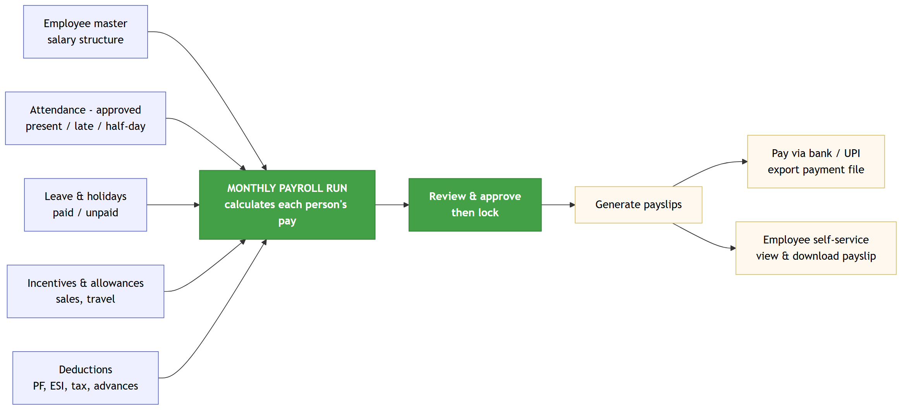
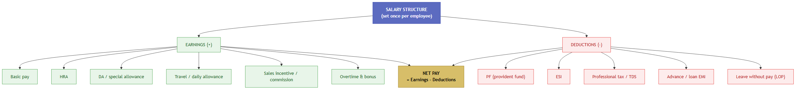
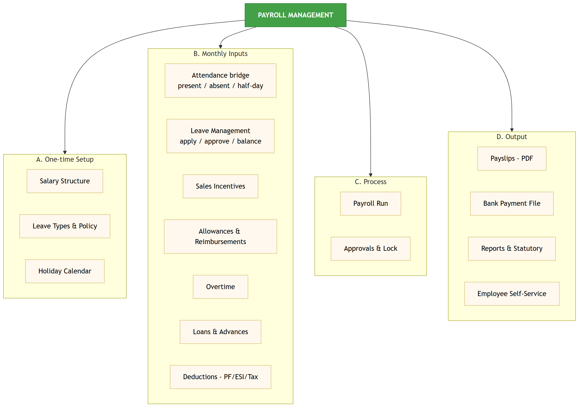

# Payroll Management — Plan, Modules & Advanced Features

**Prepared for:** Loagma CRM · 18 June 2026

This document explains how we can add **payroll** to the CRM: what we already have to build on, the modules we can add, the advanced features, how to implement it in stages, and how it will be used each month.

| | Count |
|---|---|
| ✅ Foundations already in place | **4** |
| ➕ Payroll modules we can add | **16** |
| 🎯 Total payroll modules | **16** |

---

## 1. What we already have (the foundation)

Payroll doesn't start from zero — the CRM already captures most of the data payroll needs.

| # | Already in place | How payroll uses it |
|---|---|---|
| 1 | **Employee records** (name, role, mobile, location, shift times) | The list of people to pay |
| 2 | **Attendance** (punch in/out, work minutes, late / half-day, admin-approved) | Decides present days, LOP, overtime |
| 3 | **Shift settings** (start time, grace minutes) | Defines late / on-time / half-day rules |
| 4 | **Admin approval workflow** | Same approve-then-lock idea reused for payroll |

**What's missing today:** there is **no salary information** on employees, **no leave management** (the "Apply Leave" menu isn't wired), and **no payroll, payslips, or deductions** at all. Everything in Part 3 is new.

---

## 2. How payroll will work

Each month the system pulls salary structure + attendance + leave + incentives + deductions, calculates everyone's pay, lets the admin review and lock it, then produces payslips and a payment file.

---

## 3. Salary structure — earnings minus deductions

Set each employee's pay components once. Every payroll run uses them automatically.

- **Earnings (+):** Basic, HRA, DA/special allowance, travel/daily allowance, sales incentive, overtime & bonus
- **Deductions (−):** PF, ESI, professional tax / TDS, advance or loan EMI, leave without pay (LOP)
- **Net Pay = Earnings − Deductions** (the take-home amount on the payslip)

---

## 4. Modules we can add (16)

### A. One-time setup (3)

| # | Module | What it does |
|---|---|---|
| 1 | **Salary Structure** | Define pay components (basic, HRA, allowances) per employee or per role |
| 2 | **Leave Types & Policy** | Set leave types (casual, sick, paid) and yearly quota |
| 3 | **Holiday Calendar** | Company holidays + weekly offs, so those days aren't marked absent |

### B. Monthly inputs (7)

| # | Module | What it does |
|---|---|---|
| 4 | **Attendance bridge** | Turns punch data into present / absent / half-day / LOP automatically |
| 5 | **Leave Management** | Employee applies, manager approves, balance updates, feeds payroll |
| 6 | **Sales Incentives** | Reward based on leads/orders (ties into the existing sales data) |
| 7 | **Allowances & Reimbursements** | Travel/DA and expense claims with approval |
| 8 | **Overtime** | Extra hours beyond shift, paid at a set rate |
| 9 | **Loans & Advances** | Staff request advance; auto-recover in monthly instalments |
| 10 | **Deductions (PF / ESI / Tax)** | Statutory and other deductions calculated each run |

### C. Process (2)

| # | Module | What it does |
|---|---|---|
| 11 | **Payroll Run** | One click to calculate everyone's pay for the month |
| 12 | **Approvals & Lock** | Admin reviews, approves, and locks so figures can't change later |

### D. Output (4)

| # | Module | What it does |
|---|---|---|
| 13 | **Payslips (PDF)** | A clear monthly slip per employee, shareable on WhatsApp/email |
| 14 | **Bank Payment File** | Export a NEFT/UPI sheet to pay everyone at once |
| 15 | **Reports & Statutory** | Salary register, PF/ESI returns, cost reports |
| 16 | **Employee Self-Service** | Staff view/download their own payslips and leave balance in the app |

---

## 5. Advanced features (what makes it powerful)

- **Auto attendance-to-pay** — present days, half-days, late deductions and LOP calculated straight from punch data; no manual marking.
- **Sales-linked incentives** — automatically reward telecallers/salesmen based on leads created, verified, or converted (uses data the CRM already has).
- **Pro-rata for joiners/leavers** — correct pay for someone who joined or left mid-month.
- **Arrears & back-pay** — handle salary revisions applied to past months.
- **Loan EMI auto-recovery** — set an advance once; instalments deduct automatically until cleared.
- **Lock & audit trail** — once a month is locked, every change is recorded (who, what, when).
- **Role-based access** — only admin/HR see salaries; managers only approve leave/attendance.
- **One-tap payslip sharing** — send payslips to staff over WhatsApp/email.
- **Geo + attendance honesty** — reuse the existing punch-in photo & location to keep attendance (and therefore pay) trustworthy.
- **Year-end summary** — annual earnings statement for each employee.

---

## 6. How to implement (suggested stages)

Build in stages so something useful ships early and risk stays low.

| Stage | What ships | Rough effort | Why this order |
|---|---|---|---|
| 1 | Add salary fields to employees + **Salary Structure** | ~2–3 days | Nothing can be paid without this |
| 2 | **Attendance bridge** (present/absent/half-day/LOP) | ~2 days | Reuses data we already capture |
| 3 | **Payroll Run + Payslip (PDF)** | ~3–4 days | The core: produce real payslips |
| 4 | **Leave Management** | ~2–3 days | Makes attendance/pay accurate |
| 5 | **Deductions + Loans/Advances** | ~2–3 days | Correct net pay |
| 6 | **Reports + Bank file + Self-service** | ~3 days | Finish the loop: pay & share |
| 7 | **Sales incentives + advanced items** | as needed | Layer on once the basics run |

**Recommended first step:** Stage 1 + Stage 2 + Stage 3 — salary structure, attendance bridge, and a working payslip. That alone replaces manual salary calculation.

---

## 7. How it will be used (the monthly cycle)

1. **Once:** admin sets each employee's salary structure, leave policy, and holiday calendar.
2. **Through the month:** staff punch attendance (already happening), apply for leave, and claim travel/expenses; managers approve.
3. **Month end:** admin clicks **Run Payroll** — the system calculates pay for everyone.
4. **Review:** admin checks the figures, fixes anything, then **locks** the month.
5. **Pay:** export the bank/UPI file and pay; payslips are generated.
6. **Share:** payslips appear in each employee's app (self-service) and can be sent on WhatsApp/email.

---

## 8. Quick wins (using data we already have)
1. A simple **present-days report** per employee straight from existing attendance.
2. **Late/half-day counts** per month (the flags are already recorded).
3. A basic **salary field** on the employee profile to start tracking pay even before full payroll.
