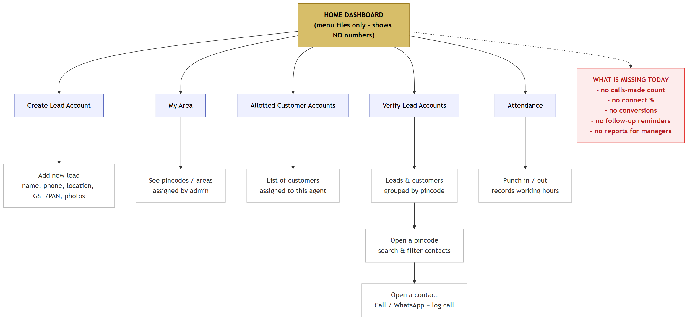
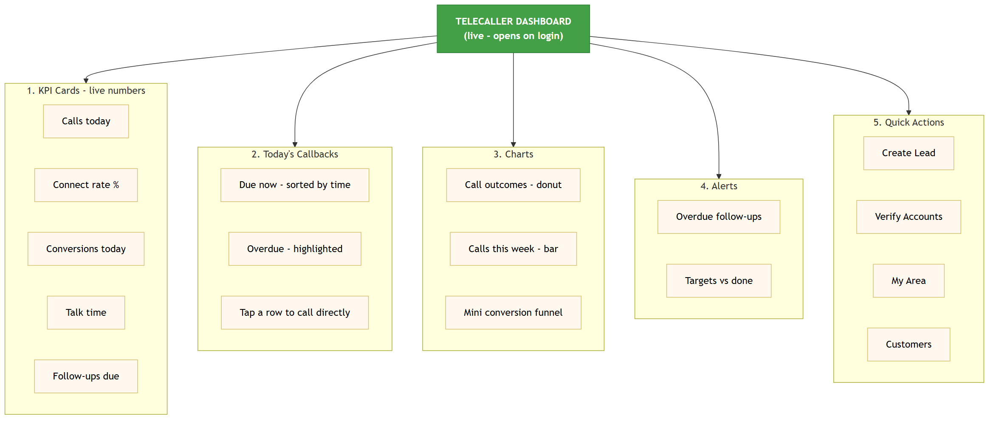

# Telecaller — Modules We Have & Modules We Can Add

**Prepared for:** Loagma CRM · 18 June 2026

| | Count |
|---|---|
| ✅ Modules we have now | **7** |
| ➕ Modules we can add | **18** |
| 🎯 Total possible | **25** |

---

## ✅ Current Modules (7)

| # | Module | What it does |
|---|---|---|
| 1 | **Home Dashboard** | Menu screen to open the agent's tools |
| 2 | **Create Lead Account** | Add a new lead (name, phone, location, GST/PAN, photos) |
| 3 | **My Area** | Shows the pincodes/areas assigned to the agent |
| 4 | **Verify Lead Accounts** | Leads & customers grouped by pincode, with search & filter |
| 5 | **Call & Verify** | Call / WhatsApp + log outcome, notes, follow-up, stage, approve/reject |
| 6 | **Allotted Customer Accounts** | Customers assigned to the agent for follow-up |
| 7 | **Attendance** | Punch in / out to record working hours |

---

## ➕ Modules We Can Add (18)

### For the agent's daily work (7)

| # | Module | What it does |
|---|---|---|
| 1 | **Telecaller Dashboard (live numbers)** | Calls today, connect %, conversions, follow-ups due |
| 2 | **Today's Callback List** | One screen of every lead due for a callback today |
| 3 | **Call History** | See the last conversation before dialling |
| 4 | **Worklist Labels** | Mark who's *not called / called today / follow-up due* |
| 5 | **Quick Actions** | One-tap "wrong number" / "do not call" |
| 6 | **Reschedule Callback** | Snooze or move a follow-up in one tap |
| 7 | **Call Scripts** | Show the right talking points per stage/campaign |

### Reports for managers (6)

| # | Module | What it does |
|---|---|---|
| 8 | **Daily / Weekly / Monthly Report** | Call activity over time |
| 9 | **Conversion Funnel** | Leads called → connected → interested → customers |
| 10 | **Team Leaderboard** | Compare agents on calls, connect %, conversions |
| 11 | **Area Performance** | Which pincodes convert best |
| 12 | **Lost-Reason Report** | Top reasons leads don't convert |
| 13 | **Export to Excel** | Download any report |

### Extras for later (5)

| # | Module | What it does |
|---|---|---|
| 14 | **Callback Reminders** | Notify the agent when a callback is due |
| 15 | **Auto Next-Call** | Finish one call, the next lead appears automatically |
| 16 | **Campaign Tags** | Group calls by marketing drive and compare |
| 17 | **WhatsApp / SMS Templates** | Send ready-made messages in a tap |
| 18 | **Do-Not-Call Protection** | Flagged numbers can't be dialled by mistake |

---

## The big one: the Dashboard

---

### Diagram 1 — Current Dashboard (what we have today)

The Home screen is **only a menu of tiles**. Each tile opens a tool, but the screen itself shows **no numbers** — the agent and the manager can't see how the day is going. The red box lists exactly what's missing.

**What each tile opens**
- **Create Lead Account** → add a new lead (name, phone, location, GST/PAN, photos)
- **My Area** → the pincodes/areas assigned by the admin
- **Allotted Customer Accounts** → customers assigned to this agent
- **Verify Lead Accounts** → leads & customers by pincode → open a pincode → open a contact → call & log
- **Attendance** → punch in/out (working hours)

**Missing today:** calls-made count · connect % · conversions · follow-up reminders · manager reports

---

### Diagram 2 — Recommended Dashboard (what we can add)

A **live dashboard** that opens on login and shows everything at a glance, in 5 sections.

**The 5 sections**
1. **KPI Cards (live numbers)** — calls today · connect rate % · conversions today · talk time · follow-ups due
2. **Today's Callbacks** — due now (sorted by time) · overdue (highlighted) · tap a row to call directly
3. **Charts** — call outcomes (donut) · calls this week (bar) · mini conversion funnel
4. **Alerts** — overdue follow-ups · targets vs done
5. **Quick Actions** — Create Lead · Verify Accounts · My Area · Customers
